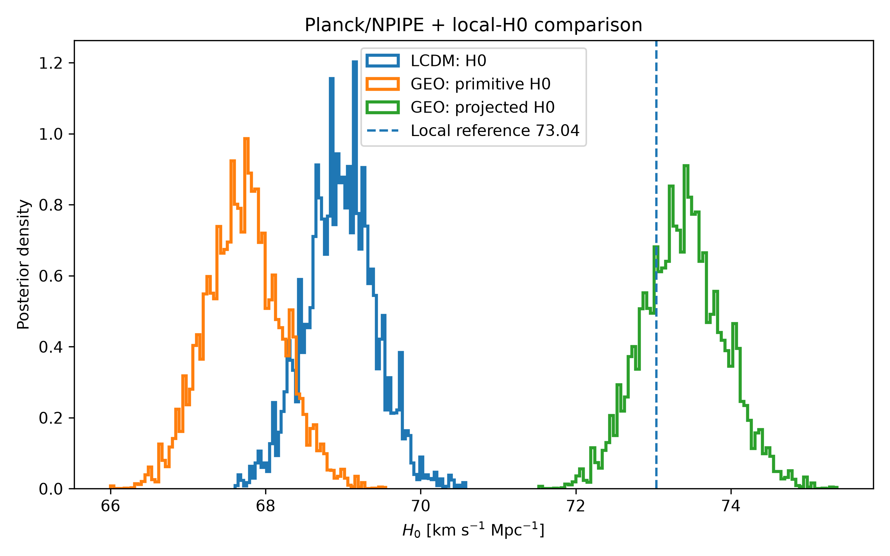

# GEO Cosmology MCMC Validation

## Reproducible cosmological tests of the GEO framework

This repository contains the publication-oriented numerical validation
package for the GEO (Hidden Geometry) framework.

The objective of this analysis is to test whether the canonical GEO
geometric node can be propagated through cosmological observables and
compared against a matched ΛCDM control using Planck/NPIPE likelihoods
and a local-$H_0$ likelihood.

---

## Main numerical result



The extended GEO calculation yields approximately

$$
H_{0,\mathrm{primitive}}
=
67.72 \pm 0.49
\;\mathrm{km\,s^{-1}\,Mpc^{-1}},
$$

and, after application of the canonical GEO projection,

$$
H_{0,\mathrm{GEO}}
=
73.39 \pm 0.53
\;\mathrm{km\,s^{-1}\,Mpc^{-1}}.
$$

The matched best-point comparison gives

$$
\Delta\chi^2_{\mathrm{joint}}
\simeq
-19.94,
$$

for GEO minus the ΛCDM + local-$H_0$ control in the exact likelihood
configuration documented in this repository.

Negative $\Delta\chi^2$ indicates a lower best-point chi-square for
the GEO realization in this specific matched comparison.

---

# 1. Canonical GEO node

The canonical GEO efficiency is

$$
\eta
=
\frac{3}{5}
=
0.6.
$$

The corresponding canonical coupling quantity is

$$
f_c
=
\sqrt{\eta}
=
0.774596669241483.
$$

For the Hubble-channel realization used in this analysis,

$$
\mu_H
=
\eta
=
0.6.
$$

The GEO radial law is

$$
R
=
\mu_H^{1/3},
$$

which gives

$$
R
=
0.843432665301749.
$$

The GEO operator used in this realization is

$$
\Phi
=
1.88961381521168.
$$

The corresponding coefficient is

$$
\alpha
=
\frac{\Phi(1-\eta)}{\sqrt{2}}
=
0.534463497023985.
$$

The resulting GEO projection factor is

$$
P_{\mathrm{GEO}}
=
1+\alpha(1-R)
=
1.083679525222552.
$$

The local GEO Hubble realization is therefore

$$
H_{0,\mathrm{GEO}}
=
P_{\mathrm{GEO}}\,
H_{0,\mathrm{primitive}}.
$$

The general radial relation used throughout GEO is

$$
\boxed{R=\mu^{1/3}}.
$$

Here $\mu$ denotes the relevant GEO efficiency/effective state for the
channel under consideration.

In the Hubble-channel realization used in this repository,

$$
\mu_H=\eta=0.6.
$$

The historical notation $R=\eta^{1/3}$ is not used as a general
operator identity. The canonical radial law is $R=\mu^{1/3}$, while
$\eta$ and $\mu$ remain conceptually distinct quantities.

---

# 2. Cosmological data and likelihoods

The principal cosmological MCMC analysis uses:

- Planck 2018 low-$\ell$ TT;
- Planck 2018 low-$\ell$ EE;
- Planck NPIPE CamSpec TTTEEE;
- a local-$H_0$ likelihood for the joint comparison.

The numerical analysis is performed with Cobaya and CLASS.

A matched ΛCDM control is retained in order to perform a direct
comparison under the same likelihood structure.

The relevant configurations are included in the `configs/` directory.

The principal configurations are:

- `07_planck_npipe_mcmc_final_mpi.yaml`
- `28A_lcdm_planck_plus_localH0_final.yaml`
- `28B_geo_planck_plus_localH0_final.yaml`
- `29_geo_planck_plus_localH0_converge.yaml`

The numerical environment, covariance matrices, convergence histories,
checksums, and chain manifests are also preserved in this repository.

---

# 3. Independent $\eta$ validation

Before the final Hubble MCMC comparison, the canonical GEO node was
tested using profile likelihoods in which $f_c$ was allowed to vary.

The wide profile gives

$$
f_{c,\mathrm{best}}
=
0.774088414673177,
$$

and therefore

$$
\eta_{\mathrm{best}}
=
f_{c,\mathrm{best}}^2
=
0.599212873731233.
$$

The canonical GEO prediction is

$$
f_{c,\mathrm{GEO}}
=
\sqrt{\frac{3}{5}}
=
0.774596669241483,
$$

with

$$
\eta_{\mathrm{GEO}}
=
0.600000000000000.
$$

At the canonical node,

$$
\Delta\chi^2_{\mathrm{GEO}}
=
0.001005928553.
$$

The difference between the profile minimum and the canonical value is

$$
f_{c,\mathrm{GEO}}
-
f_{c,\mathrm{best}}
=
5.08254568306\times10^{-4},
$$

and

$$
\eta_{\mathrm{GEO}}
-
\eta_{\mathrm{best}}
=
7.87126268767\times10^{-4}.
$$

Thus, within this profile test, the canonical GEO node lies essentially
at the likelihood minimum.

Cross-configuration tests give a median preferred value

$$
\operatorname{median}(\eta_{\mathrm{best}})
=
0.6.
$$

Across the tested configurations, the mean chi-square penalty evaluated
at the canonical node is approximately

$$
\left\langle
\Delta\chi^2_{\mathrm{GEO}}
\right\rangle
=
0.08935,
$$

while the maximum is approximately

$$
\Delta\chi^2_{\mathrm{GEO,max}}
=
0.26765.
$$

These configurations are not all statistically independent. In
particular, several weak-lensing-like tests reuse common
BAO/SN/$f\sigma_8$/CMB information and differ primarily through their
$S_8$ prior.

Consequently, these calculations establish compatibility and
cross-configuration numerical stability of the canonical
$\eta=3/5$ node within the tested setup. They do **not** constitute an
independent measurement establishing $\eta=3/5$ as a new universal
constant of nature.

Relevant validation products are:

- `figures/figure_04_eta_profile.pdf`
- `figures/figure_05_eta_cross_configuration.pdf`
- `figures/figure_06_eta_node_penalty.pdf`
- `tables/table_05_eta_profile.csv`
- `tables/table_06_eta_cross_configuration.csv`
- `validation/eta_profile/geo18_eta_profile_source.csv`
- `validation/cross_configuration/geo20_all_profiles_source.csv`
- `validation/cross_configuration/geo20_eta_cross_configuration_source.csv`

---

# 4. ΛCDM versus GEO joint test

The final comparison propagates the same cosmological likelihood
structure through a matched ΛCDM control and through the canonical GEO
Hubble mapping.

For the extended GEO-29 calculation, the posterior primitive Hubble
parameter is

$$
H_{0,\mathrm{primitive}}
=
67.7213 \pm 0.4884
\;\mathrm{km\,s^{-1}\,Mpc^{-1}}.
$$

After applying the canonical GEO projection factor,

$$
H_{0,\mathrm{GEO}}
=
P_{\mathrm{GEO}}
H_{0,\mathrm{primitive}},
$$

the corresponding posterior is

$$
H_{0,\mathrm{GEO}}
=
73.3882 \pm 0.5292
\;\mathrm{km\,s^{-1}\,Mpc^{-1}}.
$$

The same extended chain gives approximately

$$
\Omega_m
=
0.309465,
$$

and

$$
\sigma_8
=
0.818567.
$$

The best sampled GEO-29 point gives

$$
H_{0,\mathrm{primitive}}
=
67.833577
\;\mathrm{km\,s^{-1}\,Mpc^{-1}},
$$

and therefore

$$
H_{0,\mathrm{GEO}}
=
73.509859
\;\mathrm{km\,s^{-1}\,Mpc^{-1}}.
$$

At this best sampled GEO point,

$$
\chi^2_{\mathrm{CMB}}
=
10962.919,
$$

$$
\chi^2_{\mathrm{local}\,H_0}
=
0.204111,
$$

and

$$
\chi^2_{\mathrm{joint}}
=
10963.123111.
$$

For the matched ΛCDM + local-$H_0$ control, the corresponding
best sampled quantities are

$$
H_0
=
68.764470
\;\mathrm{km\,s^{-1}\,Mpc^{-1}},
$$

$$
\chi^2_{\mathrm{CMB}}
=
10966.161,
$$

$$
\chi^2_{\mathrm{local}\,H_0}
=
16.901034,
$$

and

$$
\chi^2_{\mathrm{joint}}
=
10983.062034.
$$

Defining

$$
\Delta\chi^2
=
\chi^2_{\mathrm{GEO}}
-
\chi^2_{\Lambda\mathrm{CDM}},
$$

the matched best-point comparison gives

$$
\Delta\chi^2_{\mathrm{CMB}}
=
-3.242,
$$

$$
\Delta\chi^2_{\mathrm{local}\,H_0}
=
-16.696923,
$$

and

$$
\boxed{
\Delta\chi^2_{\mathrm{joint}}
=
-19.938923
}.
$$

Negative values indicate a lower best-point chi-square for the GEO
realization relative to the matched ΛCDM + local-$H_0$ control in this
specific likelihood configuration.

These values are not a Bayesian evidence ratio and should not be
interpreted by themselves as proof that GEO supersedes ΛCDM.

---

# 5. Long-chain stability

The principal extended GEO run uses four MPI chains with 30,000 stored
rows per chain.

The total number of stored chain rows is therefore

$$
4\times30{,}000
=
120{,}000.
$$

The final recorded convergence diagnostic is

$$
R-1
=
0.017309752619.
$$

The pre-specified strict convergence target was

$$
R-1 < 0.01.
$$

The strict stopping criterion was therefore not formally reached before
the sample cap.

For this reason, GEO-29 is reported as a long-chain, numerically stable
result rather than as a formally converged $R-1<0.01$ chain.

The convergence history nevertheless shows a substantial decrease in
the diagnostic during the extended run, reaching the final recorded
value above.

Importantly, the shorter GEO-28B and extended GEO-29 calculations give
closely consistent posterior results.

For GEO-28B,

$$
H_{0,\mathrm{GEO}}^{(28B)}
=
73.3998 \pm 0.4998
\;\mathrm{km\,s^{-1}\,Mpc^{-1}},
$$

whereas GEO-29 gives

$$
H_{0,\mathrm{GEO}}^{(29)}
=
73.3882 \pm 0.5292
\;\mathrm{km\,s^{-1}\,Mpc^{-1}}.
$$

The close agreement between the shorter and extended calculations is
reported as a numerical stability check. It does not replace the
pre-specified formal convergence criterion.

The complete convergence history is shown in

`figures/figure_02_convergence.pdf`

and the corresponding numerical diagnostics are preserved in the
`checkpoints/` directory.

---

# 6. Figures

The publication package contains six principal figures.

### Figure 1 — Hubble posterior comparison

`figures/figure_01_h0_posteriors.pdf`

Comparison of the relevant $H_0$ posterior distributions for the
matched cosmological calculations.

### Figure 2 — MCMC convergence

`figures/figure_02_convergence.pdf`

Convergence history of the extended MCMC calculation.

### Figure 3 — $H_0$–$\Omega_m$ structure

`figures/figure_03_H0_Omega_m.pdf`

Joint posterior structure in the $H_0$–$\Omega_m$ plane.

### Figure 4 — GEO $\eta$ profile

`figures/figure_04_eta_profile.pdf`

Profile likelihood around the canonical GEO efficiency node.

### Figure 5 — Cross-configuration $\eta$ stability

`figures/figure_05_eta_cross_configuration.pdf`

Preferred $\eta$ values across the tested configurations.

### Figure 6 — Canonical-node penalty

`figures/figure_06_eta_node_penalty.pdf`

Chi-square penalty associated with evaluating the tested configurations
at the canonical $\eta=3/5$ node.

Both PDF and PNG versions of the figures are supplied.

---

# 7. Tables

Machine-readable CSV tables are supplied in the `tables/` directory.

They contain:

- canonical GEO quantities;
- posterior summaries;
- best-fit comparisons;
- MCMC chain diagnostics;
- matched ΛCDM/GEO head-to-head statistics;
- the $\eta$ profile likelihood;
- cross-configuration $\eta$ stability results.

The principal tables are:

- `table_00_geo_constants.csv`
- `table_01_posterior_summary.csv`
- `table_02_bestfit_comparison.csv`
- `table_03_chain_diagnostics.csv`
- `table_04_head_to_head.csv`
- `table_05_eta_profile.csv`
- `table_06_eta_cross_configuration.csv`

A compact human-readable summary is also provided in

`RESULTS.md`.

---

# 8. Reproducibility

The numerical environment used for this release has been frozen and
documented.

The reproducibility package includes:

- Python version;
- Cobaya version;
- NumPy version;
- Pandas version;
- SciPy version;
- MPI information;
- Python package freeze;
- CLASS source hashes;
- GEO-modified CLASS source hashes;
- YAML configurations;
- MCMC checkpoints;
- covariance matrices;
- convergence progress files;
- SHA256 hashes of the raw MCMC chains;
- SHA256 hashes of the publication package.

The raw chains used for the principal calculations are identified in

`manifests/chains_manifest.txt`.

The manifest records, for each chain:

- file identity;
- file size;
- number of stored rows;
- SHA256 checksum.

The complete raw chains should accompany the archival DOI release when
the dataset is deposited in a long-term scientific repository.

The frozen reproducibility statement is available in

`REPRODUCIBILITY_FREEZE.txt`.

---

# 9. Internal consistency audit

A dedicated publication-consistency audit is included as

`scripts/33_audit_publication_consistency.py`.

The frozen release passes the audit with

$$
\eta
=
0.600000000000000,
$$

$$
\mu_H
=
0.600000000000000,
$$

$$
R
=
0.843432665301749,
$$

$$
\alpha
=
0.534463497023985,
$$

and

$$
P_{\mathrm{GEO}}
=
1.083679525222552.
$$

The audit independently reconstructs the principal GEO-29 result

$$
H_{0,\mathrm{GEO}}
=
73.388162591
\;\mathrm{km\,s^{-1}\,Mpc^{-1}},
$$

together with

$$
\Delta\chi^2_{\mathrm{joint}}
=
-19.938922520,
$$

and verifies the frozen convergence diagnostic

$$
R-1
=
0.017309752619.
$$

The corresponding frozen audit log is supplied in

`logs/33_audit_publication_consistency.log`.

---

# 10. Scope and limitations

This repository reports a numerical test of a specific cosmological
realization of the GEO framework.

The principal limitations are documented explicitly in

`docs/LIMITATIONS.md`.

In particular:

1. the extended GEO-29 chains reached $R-1\simeq0.01731$, but did not
   reach the stricter pre-specified target $R-1<0.01$;

2. the profile-likelihood results demonstrate compatibility of the
   canonical $\eta=3/5$ node with the tested configurations, but do not
   independently establish $\eta=3/5$ as a universal constant of
   nature;

3. the Hubble-channel identification $\mu_H=\eta$ remains a physical
   hypothesis of the GEO framework;

4. the reported $\Delta\chi^2$ values apply to the exact likelihood and
   model configuration documented here and are not Bayesian evidence
   ratios;

5. the provenance and observational reference associated with the
   adopted local-$H_0$ likelihood must be stated explicitly in any
   scientific manuscript based on this analysis;

6. additional independent observables and out-of-sample tests are
   required to assess the broader physical validity of the GEO
   framework.

---

# 11. Repository structure

```text
GEO-Cosmology-MCMC/
├── checkpoints/
│   ├── covariance matrices
│   ├── MCMC checkpoints
│   └── convergence progress files
├── checksums/
│   ├── publication_sha256.txt
│   ├── repository_sha256.txt
│   └── source_sha256.txt
├── configs/
│   ├── 07_planck_npipe_mcmc_final_mpi.yaml
│   ├── 28A_lcdm_planck_plus_localH0_final.yaml
│   ├── 28B_geo_planck_plus_localH0_final.yaml
│   └── 29_geo_planck_plus_localH0_converge.yaml
├── docs/
│   ├── LIMITATIONS.md
│   └── METHODS.md
├── environment/
│   ├── environment.txt
│   └── requirements_freeze.txt
├── figures/
│   ├── figure_01_h0_posteriors
│   ├── figure_02_convergence
│   ├── figure_03_H0_Omega_m
│   ├── figure_04_eta_profile
│   ├── figure_05_eta_cross_configuration
│   └── figure_06_eta_node_penalty
├── logs/
│   ├── 30_build_publication_assets.log
│   ├── 31_build_eta_validation_assets.log
│   ├── 32_freeze_reproducibility.log
│   └── 33_audit_publication_consistency.log
├── manifests/
│   └── chains_manifest.txt
├── scripts/
│   ├── 30_build_publication_assets.py
│   ├── 31_build_eta_validation_assets.py
│   ├── 32_freeze_reproducibility.py
│   └── 33_audit_publication_consistency.py
├── summaries/
│   ├── GEO_ETA_VALIDATION_SUMMARY.txt
│   └── GEO_MCMC_PUBLICATION_SUMMARY.txt
├── tables/
│   ├── table_00_geo_constants.csv
│   ├── table_01_posterior_summary.csv
│   ├── table_02_bestfit_comparison.csv
│   ├── table_03_chain_diagnostics.csv
│   ├── table_04_head_to_head.csv
│   ├── table_05_eta_profile.csv
│   └── table_06_eta_cross_configuration.csv
├── validation/
│   ├── cross_configuration/
│   └── eta_profile/
├── CITATION.cff
├── LICENSE
├── README.md
├── REPRODUCIBILITY_FREEZE.txt
└── RESULTS.md
```

---

# 12. Reproducing the publication assets

The publication-oriented assets can be regenerated using the supplied
scripts.

From the corresponding GEO MCMC environment:

```bash
python scripts/30_build_publication_assets.py
python scripts/31_build_eta_validation_assets.py
python scripts/32_freeze_reproducibility.py
python scripts/33_audit_publication_consistency.py
```

The consistency audit should terminate with:

```text
AUDIT PASSED
All frozen numerical quantities are internally consistent.
```

Exact reproduction of the full cosmological calculation additionally
requires the corresponding CLASS/Cobaya likelihood environment and the
external cosmological datasets described in the configuration and
environment files.

---

# 13. Scientific interpretation

The numerical result reported by this repository can be summarized in
three distinct statements.

First, when the GEO efficiency parameter is profiled in the validation
configuration, the likelihood minimum occurs at

$$
\eta_{\mathrm{best}}
=
0.599212873731233,
$$

extremely close to the canonical GEO value

$$
\eta_{\mathrm{GEO}}
=
\frac{3}{5}
=
0.6.
$$

Second, when the canonical Hubble-channel mapping is applied to the
primitive cosmological posterior,

$$
H_{0,\mathrm{GEO}}
=
P_{\mathrm{GEO}}H_{0,\mathrm{primitive}},
$$

the extended GEO calculation maps

$$
H_{0,\mathrm{primitive}}
=
67.7213 \pm 0.4884
$$

to

$$
H_{0,\mathrm{GEO}}
=
73.3882 \pm 0.5292
\;\mathrm{km\,s^{-1}\,Mpc^{-1}}.
$$

Third, under the exact matched joint likelihood comparison documented
here, the best sampled GEO realization has

$$
\Delta\chi^2_{\mathrm{joint}}
=
-19.938923
$$

relative to the ΛCDM + local-$H_0$ control.

Together, these results motivate further independent tests of the GEO
mapping. They do not, by themselves, establish the universality of the
canonical efficiency, constitute Bayesian model selection, or replace
independent observational validation.

---

# 14. Citation and license

Citation metadata are supplied in

`CITATION.cff`.

The software and repository materials are released under the MIT
License. See

`LICENSE`

for the complete license text.

---

## Author

**Leonel Torreblanca**

GEO — Hidden Geometry Framework

2026
